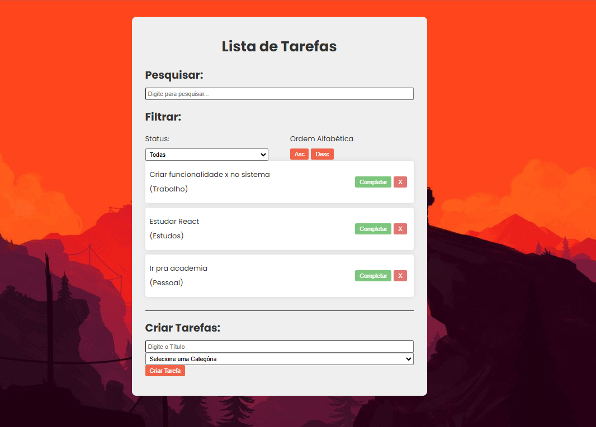
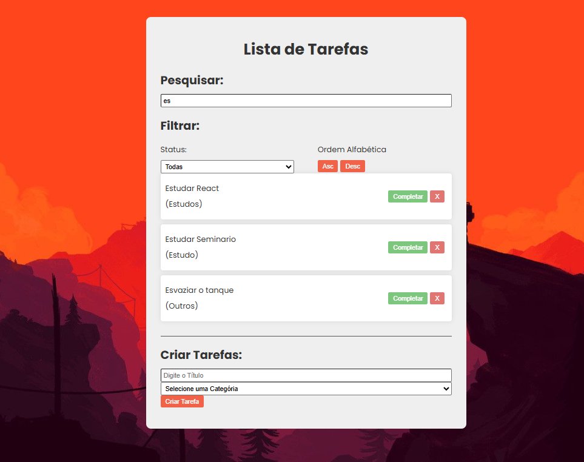
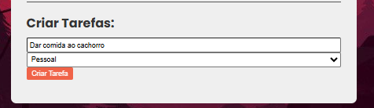
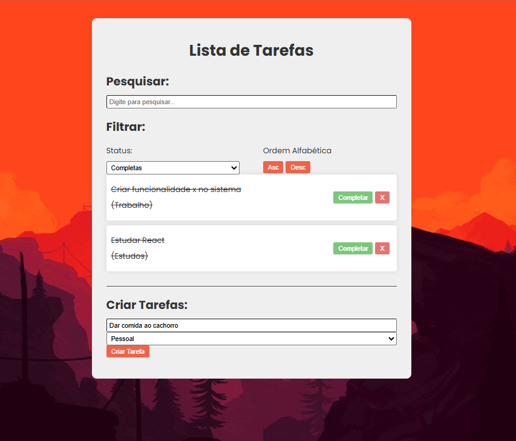

# Tutorial: Criando uma To-Do List com Vite.js

## Objetivo

Desenvolver um aplicativo simples de lista de tarefas (*to-do list*) com as seguintes funcionalidades:

- Adicionar novas tarefas.
- Marcar tarefas como concluídas.
- Remover tarefas.
- Filtrar tarefas.
- Buscar tarefas.

---

## Passo-a-Passo para o Desenvolvimento

### 1. Instalação dos Softwares Necessários

#### Passo 1: Instalar Node.js e npm

1. Acesse [Node.js](https://nodejs.org) e baixe a versão LTS (recomendada).
2. Verifique a instalação com os comandos:

```sh
node -v
npm -v
```

#### Passo 2: Instalar IDE (ex. VSCode)

1. Baixe o [VSCode](https://code.visualstudio.com/).
2. Instale as seguintes extensões:
   - **ESLint**: Para análise de código.
   - **Prettier**: Para formatação automática.
   - **React Developer Tools**: Integração com React.

### Passo 3: Criar o Repositório no GitHub
1. Acesse o [GitHub](https://github.com/) e crie um novo repositório vazio.
2. Copie a URL do repositório e inicialize o repositório localmente:
   ```sh
   git init
   git remote add origin <URL_DO_REPOSITORIO>

#### Passo 4: Criar um Projeto com Vite.js

1. Execute no terminal do VSCode:

```sh
npm create vite@latest
```

2. Escolha o nome do projeto (ex: `todo-list`).
3. Selecione **React** e **JavaScript**.
4. Entre na pasta do projeto e instale as dependências:

```sh
cd todo-list
npm install
npm run dev
```

---

### 5 Estrutura do Projeto
O projeto foi estruturado da seguinte forma:

my-todo-app/

- **Filter e Search**: Rithiellen Kariny
- **Todo e TodoForm**: Mateus Henrique
- **App.jsx, App.css, main, index**: Carlos Henrique


### 5.1 Componentes Desenvolvidos

#### 1 Criar Componente de Formulário (TodoForm.jsx)

Permite a adição de novas tarefas.
```jsx
import {useState} from 'react'

const TodoFormes = ({addTodo}) => {
    const [value, setValue] = useState ("");
    const [category, setCategory] = useState("");

    const handleSubmit = (e) => {
        e.preventDefault()
        if(!value || !category) return;
        addTodo(value, category);
        setValue("");
        setCategory("");
    };

  return (
    <div className='todo-form'>
        <h2>Criar Tarefas:</h2>
         <form onSubmit={handleSubmit}>
            <input  
                type="text" 
                placeholder='Digite o Título'
                value={value} 
                onChange={(e) => setValue(e.target.value)} 
            />
            <select value={category} onChange={(e) => setCategory(e.target.value)}>
                <option value="Selecione uma Categória">Selecione uma Categória</option>
                <option value="Trabalho">Trabalho</option>
                <option value="Estudo">Estudo</option>
                <option value="Pessoal">Pessoal</option>
                <option value="Outros">Outros</option>
            </select>
        <button type='Submit'>Criar Tarefa</button> 
         </form>
    </div>)
};

export default TodoFormes;

``` 

#### 2 Criar Componente de Item de Tarefa (Todo.jsx)

Exibe uma tarefa com opções para concluir ou remover.

```jsx
import React from 'react'

const Todo = ({todo, removeTodo, completeTodo}) => {
  return (
    <div className="todo" 
    style={{ textDecoration: todo.isCompleted ? "line-through": "" }}
    >

        <div className="content">
              <p>{todo.text}</p> 
              <p className="category">({todo.category})</p>
        </div>
        <div> 
            <button className='complete'onClick={() => completeTodo(todo.id)}>
                Completar
            </button>
            <button className='remove'onClick={() => removeTodo(todo.id)}>
                X
            </button>
        </div>
    </div> 
  );
};

export default Todo;

```

---


#### 3. Criar Componente de Pesquisa (Search.jsx)

Pesquisa as tarefas.

```jsx
const Search = ({ search, setSearch }) => {
  return (
    <div className="search">
        <h2>Pesquisar:</h2>
        <input 
            type="text" 
            value={search} 
            onChange={(e) => setSearch(e.target.value)} 
            placeholder="Digite para pesquisar..." 
        />
    </div>
  );
};

export default Search


```

####  4. Criar Componente de Filtro e Ordenação (Filter.jsx)

Permite filtrar e ordenar as tarefas.

```jsx
const Filter = ({ filter, setFilter, setSort }) => {
  return (
    <div className="filter">
      <h2>Filtrar:</h2>
      <div className="filter-options">
        <div>
            <p>Status: </p>
            <select value={filter} onChange={(e) => setFilter(e.target.value)}>
                <option value="All">Todas</option>
                <option value="Completed">Completas</option>
                <option value="Incompleted">Incompletas</option>
            </select>
        </div>
        <div>
            <p>Ordem Alfabética</p>
            <button onClick={() => setSort("Asc")}>Asc</button>
            <button onClick={() => setSort("Desc")}>Desc</button>
        </div>
      </div>
    </div>
  )
}

export default Filter
```

---

### 5.2 Implementação no App.jsx

```jsx
import { useState } from 'react'

import Todo from './components/Todo.jsx';
import TodoFormes from './components/TodoFormes.jsx';
import Search from './components/Search.jsx';
import Filter from './components/Filter.jsx';

import "./App.css"; 

function App() {
  const [todos, setTodos] = useState([
    {
      id:1,
      text: "Criar funcionalidade x no sistema",
      category: "Trabalho",
      isCompleted: false,
    },
    {
      id:2,
      text: "Ir pra academia",
      category: "Pessoal",
      isCompleted: false,
    },
    {
      id:3,
      text: "Estudar React",
      category: "Estudos",
      isCompleted: false,
    }
  ])

  const [search, setSearch] = useState("");

  const [filter, setFilter] = useState("All");
  const [sort, setSort] = useState("Asc");

  const addTodo = (text, category) => {
    const newTodos = [
      ...todos,
      {
      id: Math.floor(Math.random() * 1000),
      text,
      category,
      isCompleted:false,
    },
  ];

  setTodos (newTodos);
};

const removeTodo = (id) => {
  const newTodos = [...todos]
  const filteredTodos = newTodos.filter(todo => 
    todo.id !== id ? todo: null
  );
  setTodos(filteredTodos);
}

const completeTodo = (id) => {
    const newTodos = [...todos]
    newTodos.map((todo) => todo.id === id ? todo.isCompleted = !todo.isCompleted : todo)
    setTodos(newTodos); 
}

  return (
    <div className='app'>
      <h1>Lista de Tarefas</h1> 
      <Search search={search} setSearch={setSearch} />
      <Filter filter={filter} setFilter={setFilter} setSort={setSort}/>
      <div className='todo-list'>
        {todos
        .filter((todo) => 
          filter === "All" 
            ? true 
            : filter === "Completed" 
            ? todo.isCompleted 
            : !todo.isCompleted
          )
        .filter((todo) => 
          todo.text.toLowerCase().includes(search.toLowerCase())
        )
        .sort((a, b) => sort === "Asc" 
          ? a.text.localeCompare(b.text) 
          : b.text.localeCompare(a.text)
        )
        .map((todo)=> (
          <Todo 
            key={todo.id} 
            todo={todo} 
            removeTodo={removeTodo} 
            completeTodo={completeTodo} 
          />
        ))}
      </div>
      <TodoFormes addTodo={addTodo}/>
    </div>
  );
} 
export default App;

```

### 5.3 Estilização (App.css)

```css
body {
  font-family: 'Poppins', sans-serif;
  background-color: #f4f4f4;
  padding: 30px;
  color: #333;
  background-image: url('img/Back.jpg');
  background-position: center;
  background-size: cover;
}

.app {
  max-width: 600px;
  margin: 0 auto 300px;
  background-color: #efefef;
  padding: 20px 30px;
  border-radius: 10px;
}

h1 {
  text-align: center;
}

h2 {
  margin-bottom: 10px;
}

p{
  margin: 10px 0;
}

input {
  box-sizing: border-box;
}

button{
  background-color: #f0401e;
  color: #fff;
  padding: 5px 10px;
  margin-right: 5px;
  border: none;
  border-radius: 3px;
  cursor: pointer;
  opacity: 0.8;
  transition: 0.3s;
}

button:hover {
  opacity: 1;
}

.todo-list {
  margin-bottom: 20px;
  padding-bottom: 20px;
  border-bottom: 1px solid #555;
}

.todo {
  background-color: white;
  box-shadow: 0 0 10px rgba(0, 0, 0, 0.1);
  padding: 10px;
  margin-bottom: 10px;
  border-radius: 5px;
  display: flex;
  justify-content: space-between;
  align-items: center;
}
.complete {
  background-color: #5cb85c;
}

.remove {
  background-color: #d9534f;
}

.todo-form {
  padding-bottom: 1.5rem;
}

input,select{
  padding: 5px;
  margin-bottom: 10px
  border 1px solid #ddd;
  border-radius: 3px;
  width: 100%;
}

filter, search {
  border-bottom: 1px solid #555;
  margin-bottom: 20px;
  padding-bottom: 20px;
}

.filter-options {
  display: flex;
  justify-content: space-between;
  gap: 3rem;
}

.filter-options div {
  flex: 1 1 0;
}
```

---

### 6. Executar o Projeto

Execute no terminal do VSCode:

```sh
npm run dev
```

Acesse [http://localhost:5173](http://localhost:5173) para ver a aplicação funcionando!

### 7. Imagens do Processo

**Tela Inicial:**


**Pesquisa:**


**Adicionando uma Tarefa:**


**Filtrando e Ordenando:**


### 8. Conclusão

Este projeto demonstrou como criar uma lista de tarefas interativa com React e Vite.js. Exploramos conceitos de estado, componentes funcionais e interatividade do usuário. Possíveis melhorias incluem a persistência de dados via localStorage e uma interface aprimorada com TailwindCSS.


